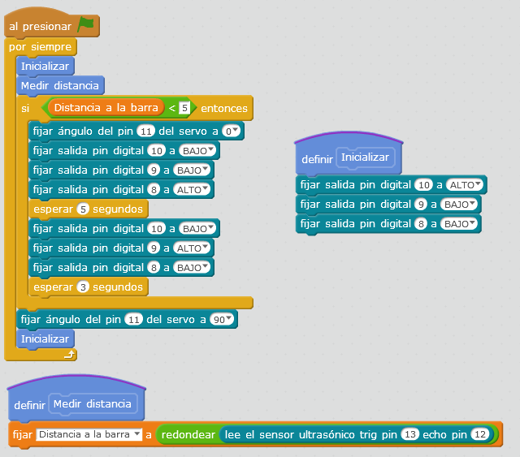

# Puerta automática

La práctica consiste en una una puerta cuya apertura esté automatizada,  ya que esta se va a abrir cuando un detector de ultrasonidos detecte a alguien delante del mismo a menos de una distancia prefijada. La puerta es accionada por un servomotor y un semaforo nos indica si podemos pasar (semaforo en verde) o si la puerta está a punto de cerrarse (semaforo en ambar o amarillo) o si está cerrada (semaforo en rojo).

## Materiales

- 1 Placa de Arduino
- 1 Protoboard
- 1 Sensor ultrasónico HC-SR4 
- 1 Miniservo
- 11 latiguillos
- 3 resistencias de 220 Ω
- 3 led (rojo, amarillo y verde)

## Esquema eléctrico

Llevamos la tensión de 5V y GND de la placa arduino a la protoboard. Fijándonos en los pines del sensor de ultrasonidos, se conecta el pin Vcc a la línea de positivo de la placa y el GND a la de negativos y los pines triger y echo a los pines 13 y 12 respectivamente.

Conectamos el cable rojo (positivo del servomotor) a la línea de positivo de la placa y  el cable negro (negativo del servomotor) a la línea de negativos y el color amarillo al pin analógico PWM 11 de la placa de arduino.

Por último, conectamos el ánodo de cada led a los pines 10, 9 y 8 tal y como podemos ver en el esquema del circuito, y el cátodo de cada led a la línea de negativos que corresponde con el GND.

## Programación en mBlock

En primer lugar creamos un bloque que se llamará “inicializar” para que la puerta quede cerrada en caso de que la persona que se ponga delante de la puerta pase o bien no lo haga, cerrándose igualmente y volviendo a ver si sigue delante del sensor y reiniciar el proceso. Este bloque va a hacer que en cualquiera de los dos casos la puerta se cierre, el semáforo se ponga en rojo y comience de nuevo a detectar distancias con el ultrasonido.

Para ello, previamente se debe de crear la variable “distancia de barra” que será la que guarde el valor de la lectura del sensor y después con un condicional veremos si esa distancia es inferior a la fijada. Con el código que podemos ver a continuación, el microservo girará 90º dependiendo de la distancia medida y el semáforo nos indicará si la puerta está cerrada, si podemos pasar o si en breve la puerta se cerrará de la misma forma que un semáforo convencional.

